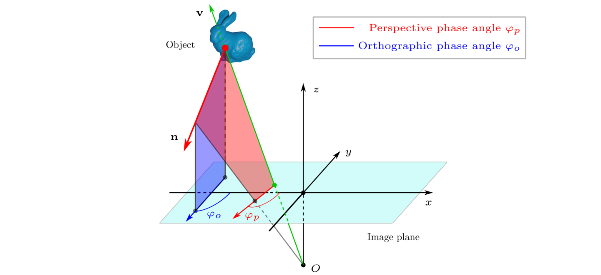

# Perspective Phase Angle Model for Polarimetric 3D Reconstruction

## Introduction

This repository contains a demo of single-view planar normal estimation for ECCV 2022 paper -Perspective Phase Angle Model for Polarimetric 3D Reconstruction-.




The PPA model defines the polarization phase angle as the direction of the intersecting line of the image plane and the plane of incident (the red plane in the above figure), and hence allows the perspective effect to be considered in estimating surface normals from the phase angles and in defining the constraint on surface normal by the phase angle.


## Environments

```
pip install opencv-python numpy skimage
```


## Normal estimation

### single-view demo

The following script show how to use the PPA model for estimating a planar surface normal.

```python
python singleview_normal.py
```

